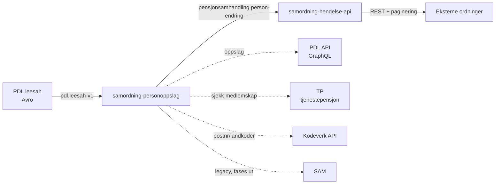

# samordning-personoppslag

Behandler personhendelser fra PDL og gjør dem tilgjengelige for eksterne tjenestepensjonsordninger.

Logikken er flyttet fra SAM (legacy SOAP) til en Kafka-basert flyt via [samordning-hendelse-api](https://github.com/navikt/samordning-hendelse-api).

## Arkitektur

## Hendelsesflyt

1. Konsumerer personhendelser fra `pdl.leesah-v1` (Avro)
2. Filtrerer bort adressebeskyttede personer
3. Sjekker TP-medlemskap — kun personer med aktive ytelser hos en tjenestepensjonsordning sendes videre
4. Publiserer til `pensjonsamhandling.person-endring` (JSON)
5. [samordning-hendelse-api](https://github.com/navikt/samordning-hendelse-api) konsumerer og tilbyr hendelsene til eksterne ordninger via REST med paginering

### Hendelsestyper

| Opplysningstype | Meldingskode | Beskrivelse |
|-----------------|--------------|-------------|
| `SIVILSTAND_V1` | `SIVILSTAND` | Endring i sivilstand |
| `DOEDSFALL_V1` | `DOEDSFALL` | Dødsfall eller annullering |
| `BOSTEDSADRESSE_V1`, `KONTAKTADRESSE_V1`, `OPPHOLDSADRESSE_V1` | `ADRESSE` | Adresseendring |
| `FOLKEREGISTERIDENTIFIKATOR_V1` | `FODSELSNUMMER` | Nytt fødselsnummer |

## REST API

| Endepunkt | Beskrivelse |
|-----------|-------------|
| `POST /api/hentIdent` | Ident-oppslag fra PDL |

## Kafka-topics

| Topic | Retning | Format |
|-------|---------|--------|
| `pdl.leesah-v1` | Konsumerer | Avro |
| `pensjonsamhandling.person-endring` | Produserer | JSON |

## Avhengigheter

| Tjeneste | Formål |
|----------|--------|
| PDL API | GraphQL-oppslag (adresse, ident, adressebeskyttelse) |
| TP | Sjekk av tjenestepensjon-medlemskap og aktive ytelser |
| Kodeverk API | Postnummer og landkoder |
| ~~SAM~~ | ~~Legacy — fases ut~~ |

## Tech stack

Kotlin · Spring Boot · Nais (FSS) · Azure AD · Kafka

## Kontakt

Slack: [#pensjon_samhandling](https://nav-it.slack.com/archives/pensjon_samhandling)
